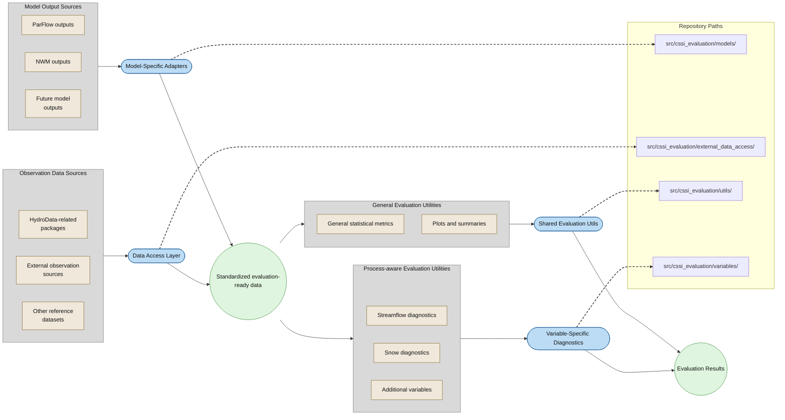

# Hydrologic Model Evaluation Framework

This repository contains a hydrologic model evaluation framework for comparing modeled outputs against observations and reference datasets at regional or national scale. The goal is not only to help users find data, but to provide a structured, reproducible workflow for model evaluation and benchmarking across hydrologic models, variables, and spatial scales.

This effort builds on earlier NSF-supported work from the [HydroGEN](https://hydro-generation.org/) and [HydroFrame](https://hydroframe.org/) projects. Those projects focused on building and serving large-scale hydrologic modeling capabilities. In that work, it became clear that community-scale options for evaluating national and regional model outputs remain limited. [HydroData](https://hydroframe.org/hydrodata) was initially developed to meet internal project needs for data access, but broader engagement showed a clear need for a framework that connects those data resources to evaluation workflows. This repository, aka `cssi_evaluation`, addresses that need.

## What this framework does

The framework brings together several pieces that operate as one workflow:

1. Model-specific adapters that extract and **format model outputs**.
2. Data-access tools that **retrieve observations** and reference datasets.
3. Shared evaluation utilities for **preprocessing, statistics, and plotting**.
4. **Variable-specific diagnostics** for process-aware evaluation of particular hydrologic variables.

The operational framework lives under [`src/cssi_evaluation/`](src/cssi_evaluation). The top-level [`docs/`](docs), [`examples/`](examples), and [`tests/`](tests) directories support the framework, but they are not themselves workflow stages.

## Current scope

We have started developing this framework as a **Python** package to facilitate evaluation of modeled results against real-world data. At present, the repository reflects two main modeling paths:

- ParFlow-oriented evaluation, especially for ParFlow-CONUS2.1
- National Water Model (NWM) workflows that are being organized alongside the same framework structure

Future development is expected to add both additional site-based datasets and gridded remote-sensing datasets.

HydroData-related packages such as [hf_hydrodata](https://hf-hydrodata.readthedocs.io/en/latest/) and [SubsetTools](https://hydroframesubsettools.readthedocs.io/en/latest/) are external dependencies used by this framework. They are not part of the source tree in this repository, but they are important data-access inputs, especially for the ParFlow-oriented workflow. Using those packages allows acquisition of comparison datasets to remain reproducible in code.

## How users interact with the framework

Users primarily interact with the package through Python functions and example notebooks. Typical workflows allow a user to define:

- Set up environment with required packages
- Define a domain of interest by HUC, latitude/longitude bounding box, or upstream drainage area
- Define a time range for evaluation
- Select one or more observational variables to compare against model output
- Provide model output in the required data model format

The package includes shared statistical metrics such as RMSE, MSE, Pearson correlation, Spearman rank correlation, Nash-Sutcliffe Efficiency, Kling-Gupta Efficiency, R-squared, bias, percent bias, absolute relative bias, total difference, and Condon category. It also includes plotting utilities for site-level time series and mapped summaries of evaluation metrics across sites.

## General metrics and variable-specific diagnostics

The repository intentionally separates model-agnostic evaluation tools from diagnostics that are specific to a variable or process.

- General metrics apply broadly across time series and model types.
- Variable-specific diagnostics are evaluation methods designed around the scientific behavior of a particular hydrologic variable.

For example, continuous time-series metrics are useful but may not fully capture seasonal snow behavior. Snow evaluation often requires targeted diagnostics such as:

- peak SWE same-day comparison
- peak SWE different-day comparison
- melt timing comparison

These diagnostics complement general statistical metrics by focusing on process-relevant behaviors rather than only full-series agreement.

## Framework workflow

The framework standardizes modeled and observational data before applying shared utilities and variable-specific diagnostic functions. 
Dashed arrows indicate repository locations, not workflow direction. Blue boxes represent core workflow components, green circles show 
outputs generated by the workflow, and yellow boxes denote workflow sections.




## Repository structure

```text
cssi_evaluation/
├── src/cssi_evaluation/         # Core framework code
│   ├── external_data_access/    # Observation and reference-data access helpers
│   ├── models/                  # Model-specific adapters
│   ├── utils/                   # Shared evaluation utilities
│   ├── variables/               # Variable-specific example workflow
├── examples/                    # Example notebooks and supporting assets
├── docs/                        # Project documentation and notes
├── tests/                       # Package tests
├── pyproject.toml               # Package metadata and dependencies
└── README.md
```

## What is and is not part of the workflow

The framework logic is the code under [`src/cssi_evaluation/`](src/cssi_evaluation).

The following directories are important, but they are not part of the workflow implementation itself:

- [`docs/`](docs) for narrative documentation and project references
- [`examples/`](examples) for demonstration notebooks and usage examples
- [`tests/`](tests) for validation and regression testing

## Outlook

The framework is intended to grow by adding:

- new model adapters
- new observation and reference-data pathways
- new variable-specific diagnostics
- clearer workflows for users bringing their own model outputs, including both physics-based and ML-based models

The long-term aim is to reduce the barrier to reproducible hydrologic model evaluation while keeping the code structure aligned with the scientific workflow.

## Getting Started

To get started using the framework, see the [Getting Started](./GettingStarted.md) page.
