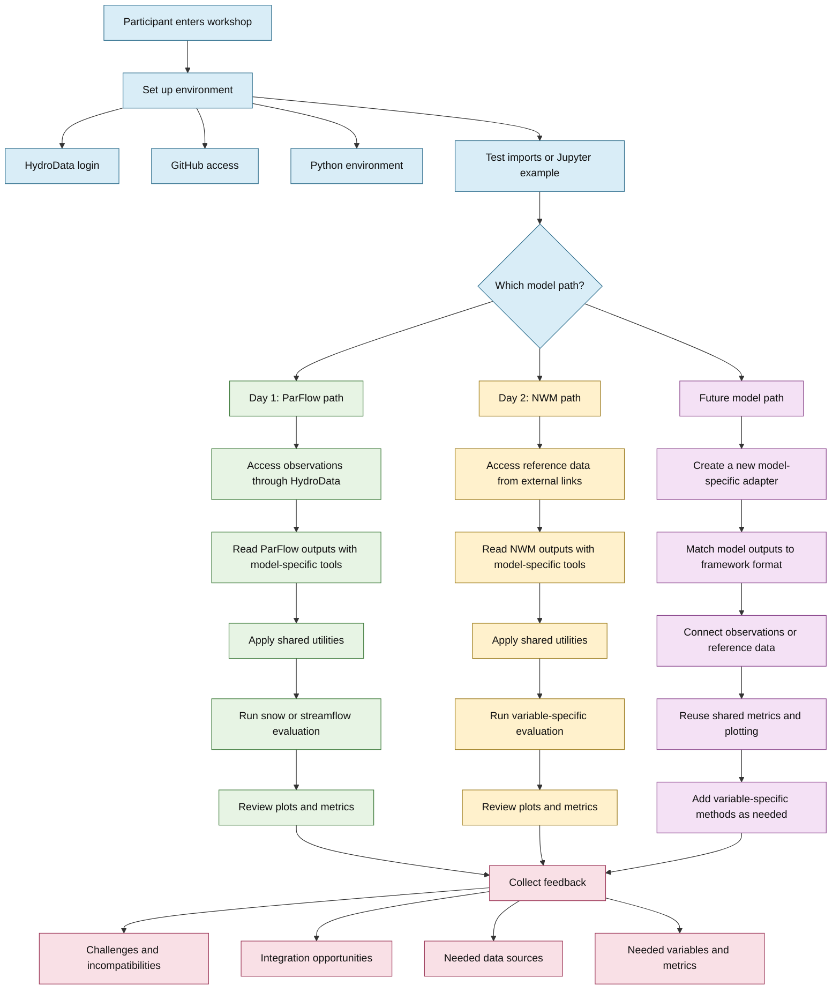

This workflow chart outlines the structure of the 2026 Modeling Hackathon. It shows how participants move from environment setup into the ParFlow and National Water Model (NWM) evaluation paths, and highlights how additional model workflows can be integrated into the same framework in future hackathons.

